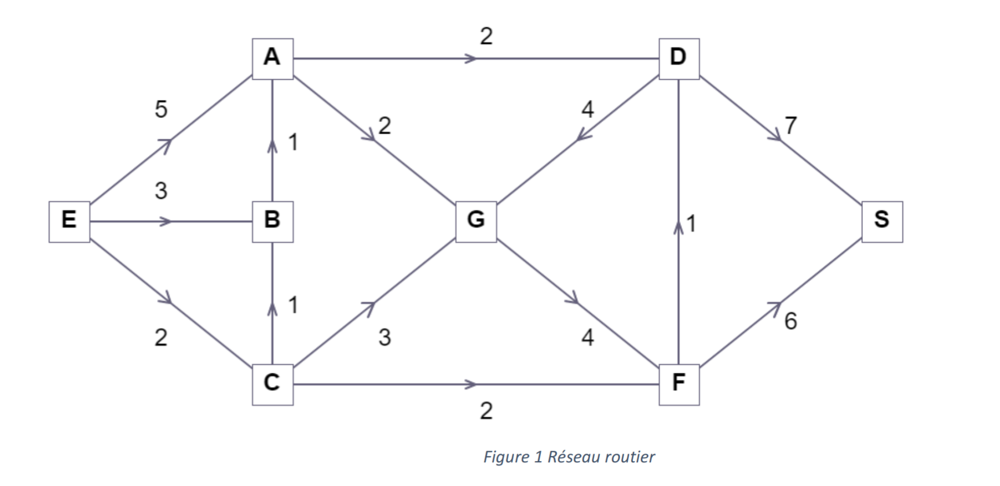
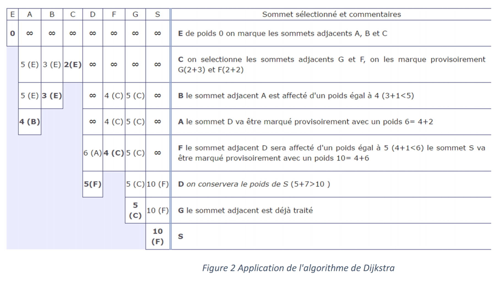

# TP3

- [Directives particulières](#directives-particuli%C3%A8res)
- [Partie 1: Introduction aux fonctions](#partie-1-introduction-aux-fonctions)
- [Partie 2: Dijskstra](#partie-2-dijskstra---amusons-nous-avec-un-classsique)
- [Annexe: Guide et normes de codage](#annexe-guide-et-normes-de-codage)

:alarm_clock: [Date de remise le Dimanche 1er novembre 23h59](https://www.timeanddate.com/countdown/generic?iso=20201101T2359&p0=165&msg=Remise&font=cursive&csz=1#)

## Directives particulières
* Pas de librairies externes autres que celles déjà importées.
* Dans chaque programme, vous pouvez ajouter d’autres fonctions à celles décrites dans l’énoncé, ainsi que d’autres structures (et sous-structures), pour améliorer la lisibilité et suivre le principe **DRY** (Don’t Repeat Yourself). À chaque endroit où vous remarquez une duplication de code (vous avez écrit les mêmes opérations plus d’une fois) et qu’il n’est pas possible de l’éliminer avec ce qui a été vu en cours, indiquez-le en commentaire.
* Afin de vous inciter à écrire du code de qualité, nous introduisons dans ce TP des **normes de codage**. Plusieurs combinaisons de normes sont possibles et utilisées dans l'univers de la programmation. L'objectif n'est pas de définir quel ensemble de norme est supérieur/inférieur aux autres. L'intérêt est de choisir un ensemble de règles pour un projet/travail et d'être constant dans son application. L'ensemble de normes le plus utilisé en Python est le [PEP8 (Python enhancement proposal)](https://www.python.org/dev/peps/pep-0008/) décrit par l'auteur de python lui-même. L'avantage d'utiliser un IDE comme pycharm est qu'il est possible de le configurer pour vous indiquer lorsque vous ne respectez pas les conventions de PEP8. Votre configuration par défaut devrait fonctionner, néanmoins vous pouvez vous référer à [cette page](https://www.jetbrains.com/help/pycharm/tutorial-code-quality-assistance-tips-and-tricks.html) si ce n'est pas le cas des problèmes.
* En extension aux normes de PEP8 nous avons rédigé quelques indications supplémentaires que vous devrez respecter au mieux. Les points pertinents pour ce travail sont donnés en annexe à la fin.

## Partie 1: Introduction aux fonctions
Cette partie est une évolution du premier exercice du dernier TP (tri par sélection), et a pour but de vous préparer pour la partie 2 du TP !

### Le but:
1. Lire des séquences de nombres dans un fichier.
2. Trier ces séquences de nombres en ordre croissant, par l'algorithme de tri par fusion.
3. Écrire les séquences de nombre, une fois triées, dans un fichier texte

### Description: 
Les problèmes de tri font partie des problèmes les plus célèbres en informatique. Il existe un nombre pratiquement infini d'algorithmes permettant de trier des éléments en ordre croissant(ou autre), toutefois tous ne sont pas égaux. En effet, bien que chaque algorithme (fonctionnel) arrive à un résultat correct, certains sont beaucoup plus performants que d'autres. La performance n'est pas critique lorsque l'on trie des centaines, voire des milliers d'éléments... Mais quand on tombe dans les millions et plus, ça devient important !

C'est là que l'algorithme de tri par fusion (merge sort) se démarque du tri par sélection vu au dernier TP. Bien que ce dernier fonctionne... Il est très lent à comparer du tri par fusion.
Cet algorithme n'est toutefois pas le plus rapide existant, mais il est une bonne introduction au monde de l'algorithmie. De plus, celui-ci utilise le principe de récursivité, qui est une notion importante à comprendre, ainsi que le principe de *diviser pour régner* qui est un *patron* important en algorithmie.

> Schéma du tri par fusion 

La fonction *.sort()* de Python, par exemple, utilise une variation de l'algorithme *merge sort*, soit le [Timsort](https://en.wikipedia.org/wiki/Timsort).

### Visualisation de l'algorithme
Cette [vidéo](https://www.youtube.com/watch?v=4VqmGXwpLqc&ab_channel=MichaelSambol) permet de bien visualiser le fonctionnement de l'algorithme de tri par fusion.

### Fonctionnement
En utilisant le principe de diviser pour régner, cet algorithme parvient à rapidement trier une séquence de nombre en ordre croissant. Les étapes, sous forme de commentaires, sont déjà placées pour vous dans le code.

Voici une *tentative* d'explication de l'algorithme. Si ce n'est pas clair, une simple recherche sur Google avec les termes: *Tri fusion étape par étape* ou bien *How to merge sort* devrait répondre à toutes vos questions.
1. Diviser la séquence de nombres en appelant récursivement la fonction de tri fusion. Cette fonction sépare la lsite reçue en 2, et fusionne les 2 parties une fois *triées*. Cette fonction atteint sa condition d'arrêt seulement quand la liste reçue est de taille 1
2. Le tri se passe dans la fonction *fusionner*. En effet, celle-ci reçoit 2 listes (de taille 1 ou plus) et place dans une liste résultat les éléments des 2 listes reçues, en ordre croissant.
3. Le tri se termine lorsque l'on revient au premier appel récursif, soit lorsque la liste résultat a la même longueur que la liste initiale.

### Notes
* Le fichier *listeDeNombres.txt* vous est fourni, et contient des lignes contenant des séquences de nombre à trier. Ces nombres sont séparés par des *espaces*, et les lignes par des *sauts de ligne*. La dernière ligne du fichier est une ligne vide.
* Les résultats doivent être enregistrés dans le fichier *resultats.txt*, sous la même forme qu'ils sont présentés dans le fichier *listeDeNombres.txt* (mais triés !), soit une séquence de nombres (par ligne) séparés par des espaces, avec un saut de ligne à la fin.
* Le *main* et la fonction de test *testerResultat(sequences_a_trier, sequences_triees)* n'ont pas besoin d'être modifié, seulement les fonctions *lire_fichier()*, *sauvegarder_sequences_triees(chemin, nom, liste_triees)*, *fusionner(gauche, droite)*, et *tri_fusion(sequence_de_nombre)* doivent être modifiés.
* Des instructions textuelles vous sont données pour vous indiquer quels sont les changements à effectuer.

### Pour aller plus loin
Dans le cadre de votre cheminement à Polytechnique, plus spécifiquement dans les cours *Structures de données et algorithmes(INF2010)* et *Analyse et conception d'algorithmes(INF8775)*, vous aurez l'occasion d'approfondir les différents algorithmes (incluant les algorithmes de tri !). Si vous désirez en savoir plus, voici un [vidéo](https://www.youtube.com/watch?v=kPRA0W1kECg&ab_channel=TimoBingmann) démontrant le fonctionnement visuel de différents algorithmes de tri.
Toutefois, il existe une variété assez impressionnante d'algorithmes de tri. Pour un peu d'humour et de culture info-logienne, vous pouvez consulter cette [page](https://codoholicconfessions.wordpress.com/2017/05/21/strangest-sorting-algorithms/) pour découvrir quelques-uns d'entre eux. 

## Partie 2: Dijskstra - Amusons-nous avec un classique!

Passons aux choses sérieuses. Pour ce 2e exercice, vous expérimenterez avec un des algorithmes les plus connus en informatique. Comme beaucoup d'algorithmes, son fonctionnement peut sembler obscur à première vue. Ce n'est qu'en l'implémentant que vous aurez une vue d'ensemble sur son fonctionnement et peut-être alors vous réaliserez que la logique est plutôt simple. C'est d'ailleurs ce qui en fait son efficacité.

### Contexte 

En 1959, [E. W. Dijkstra](https://en.wikipedia.org/wiki/Edsger_W._Dijkstra) (1930-2002), encore à ce jour une des figures ayant le plus influencé les sciences informatiques, s'est attaqué à un problème classique en optimisation, le [problème du plus court chemin](https://fr.wikipedia.org/wiki/Probl%C3%A8me_de_plus_court_chemin). C'est un problème dont les applications sont très larges, répondant à des questions toujours actuelles comme:

* Quelles routes dois-je prendre pour arriver le plus vite possible à mon entrevue ce matin?
* Comment router le plus efficacement entre deux appareils une série de fichiers à travers internet?

Dijsktra a donc proposé un [algorithme](https://en.wikipedia.org/wiki/Dijkstra%27s_algorithm) qui permet de trouver le plus court chemin entre deux-points dans un graphe. Par exemple, il permet de trouver le chemin le plus court entre deux villes en considérant différentes villes et le réseau routier qui les lient. On propose dans cet exercice d’implémenter cet algorithme.

> Un exemple de dijsktra en action, dans un contexte ou les distances entre les points sont toujours de "1".

### Explication de l’algorithme :
Soit le réseau routier donné par la *Figure 1*. Les villes sont données par les nœuds (A-G, E, S). Chaque route est représentée par un arc orienté qui donne le sens de circulation et la distance entre les deux villes connectées. On cherche, à travers cet exemple, de trouver le plus court chemin de la ville E à S.

Pour résoudre ce problème, Dijkstra s’est basé sur le principe suivant : Si le plus court chemin de   à   passe respectivement par deux villes notées  et  alors le segment qui lie   à   est le plus court chemin de   à . Le plus court chemin peut être ainsi construit de proche en proche en choisissant à chaque étape un sommet   tel que la longueur allant de  à  est connu être provisoirement la plus courte possible. 

### Pseudocode de Dijkstra
L’algorithme de Dijkstra est structuré suivant le pseudocode suivant :

- Étape 1 (Phase d’initialisation) : On considère un tableau **distances** dont la taille est le nombre de nœuds du réseau; il représente la plus courte distance trouvée *jusqu’à maintenant* entre  et ce nœud. On met la case correspondante au sommet  à  (la distance entre  et lui-même est nulle) et les autres à  pour dire qu’on n’a pas encore trouvé comment se rendre à ce nœud, et sera considéré comme une distance infinie dans l’algorithme. 

- **nœuds** = l’ensemble de tous les nœuds 
- **TANT QUE nœuds** n’est pas vide **FAIRE**
  - Étape 2 :  = trouver l’élément de **nœuds** le plus proche de **E** selon **distances**. 
  - Étape 3 : **POUR** chaque **nœud**  adjacent à  **FAIRE**
    - *mettre_a_jour_distance* (, ), qui vérifie si passer par  permet de réduire la longueur du trajet allant à , et modifie distances si c’est le cas.
  - Étape 4 : Enlever  de **nœuds**; le tableau **distances** contient actuellement la distance minimale de  à . 

### Exemple d'application de l'algorithme pas-à-pas
L’application pas à pas de l’algorithme sur l’exemple de la *Figure 1* est donnée par la *Figure 2*. Chaque ligne représente le même tableau **distances** (tableau 1D) à une itération différente de la boucle dans l’algorithme. Les cases en bleu (dont la valeur est omise sur la figure) conservent la valeur précédente, ce sont les cases où la distance est déjà minimale. La lettre entre parenthèses indique le sommet précédent duquel on arrive pour aller à ce nœud, et en gras est indiqué le nœud sélectionné comme étant le plus proche de **E** (à l’étape 2 de l’algorithme).  

### Structure du code
Pour coder cet algorithme, on définit deux structures, *Tableau* (liste 1D) et *Matrice* (liste 2D). La structure *Tableau* est utilisée pour représenter les données suivantes : 
- *distances* : distances calculées des différents nœuds par rapport à la source (est mis à jour graduellement en fonction des nouveaux chemins trouvés). On attribue la valeur -1 pour un chemin pas encore trouvé (distance infinie dans la *Figure 2*).
- *predecesseurs* : le prédécesseur de chaque ville dans le chemin le plus court trouvé jusqu’à maintenant. Un prédécesseur non encore défini est représenté par la valeur -1, la source elle-même n’ayant pas de prédécesseur aura aussi la valeur -1.
- *nœuds* : un tableau pour représenter l’ensemble **noeuds** définis dans le pseudocode de l’algorithme de Dijkstra présenté précédemment. Comme il sert à représenter un ensemble, au sens mathématique, l’ordre des éléments dans ce tableau n’a pas d’importance. Les valeurs dans cet ensemble sont les indices dans les tableaux *distances* et *predecesseurs*. 

La structure *Matrice* sert à représenter la matrice des poids, c’est-à-dire les distances entre villes voisines dans le graphe. Dans cette matrice, la case **[x][y]** est la longueur de la route directe de la ville *x* vers la ville *y*. La valeur -1 indique qu’il n’y a pas de route directe entre ces villes.

Pour la représentation des noeuds, on considère les indices de *0* à *n-1*, plutôt que des lettres comme dans l’exemple ci-dessus. À titre d’exemple, en considérant les nœuds de la *Figure 1* en ordre alphabétique, l’élément d’indice *0* est le nœud *A*. 

## Partie 2.1: Ajoutons un peu de vérifications
Il est primordial de baliser les entrées (inputs utilisateur comme le input() de python ou une lecture de fichier) possibles d'un programme afin de limiter les erreurs pendant l'exécution ou l'apparition d'états incohérent/non prévus en raison de valeurs incorrectes. Pour ce travail nous vous demandons d'ajouter ces deux éléments:
- Notre implémentation de Dijkstra rencontre un problème lorsque le graphe est disjoint (pas tous les noeuds sont liés en un seul graphe). Pour pallier à ce problème nous rajouterons un test qui vérifie si une connection existe bel et bien entre les deux noeuds (une valeur positive pour le sommet associé dans le tableau distance. 
- La matrice de poids doit respecter une forme bien spécifique afin que l'algorithme s'exécute correctement. Assurez-vous que les valeurs lues du fichier en entrée sont des entiers positifs (ou -1 pour indiquer qu'il n'y a pas de lien). Important de vérifier aussi que c'est bel et bien une matrice qui est lue, pour cela assurez-vous que les lignes de la matrice sont de même longueur. Pas besoin de vérifier la longueur des colonnes puisqu'un tableau 2D en python est formé d'une liste de listes horizontales.
Référez-vous aux *TODO:* dans le code pour ajouter ces éléments.
  - Pour tester ces éléments modifier le code du main afin qu'il lise la matrice à partir de poids_2_1.txt
  - Vous pouvez modifier les valeurs dans le fichier afin de faire vos tests.

## Annexe: Guide et normes de codage
- [GUIDE DE CODAGE MAISON](https://github.com/INF1007-Gabarits/Guide-codage-python) de normes supplémentaires à respecter
- [Le plugin Pycharm Pylint](https://plugins.jetbrains.com/plugin/11084-pylint) qui analyse votre code et indique certaines erreurs. Vous avertis aussi si vous ne respectez pas certaines de normes de PEP8.
- [Quelques indications en français sur PEP8](https://openclassrooms.com/fr/courses/4425111-perfectionnez-vous-en-python/4464230-assimilez-les-bonnes-pratiques-de-la-pep-8)
- [La documentation PEP8 Officielle](https://www.python.org/dev/peps/pep-0008/)

### correction_tp_3 [corrigé_tp_3](https://www.youtube.com/watch?v=dQw4w9WgXcQ)
