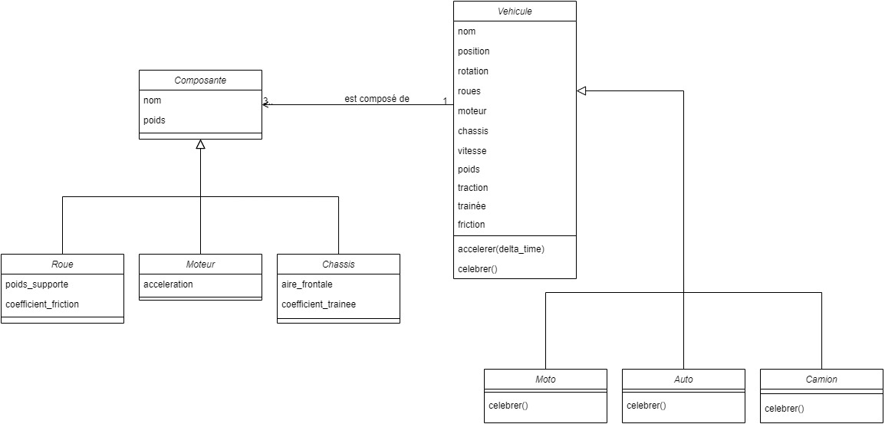
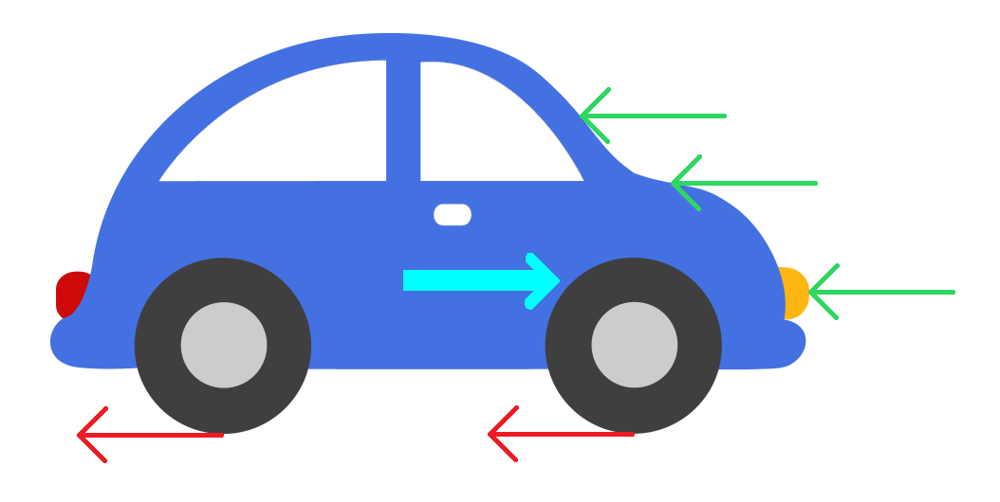

# TP6

<!--- Changer la date de remise en modifiant le URL--->
#### :alarm_clock: [Date de remise le dimanche 6 décembre à 23h59](https://www.timeanddate.com/countdown/generic?iso=20201206T2359&p0=%3A&msg=Remise+TP6&font=cursive&csz=1)

## Objectif

Ce TP a pour objectif de vous introduire à la programmation orientée objet (POO) en Python. Le TP est composé de 3 parties détaillées plus bas ainsi que les fichiers de départ pour lesquels vous devez compléter le code avec l'indicateur `TODO`.

## Consignes à respecter

Tout d'abord, assurez-vous d'avoir lu le fichier [readme.md](readme.md) au complet et d'avoir téléchargé les fichiers que vous devrez compléter.
Pour ce TP, certaines contraintes sont à respecter:

- Vous ne pouvez pas modifier le fichier dictionnaire_modeles.py, sinon le projet final risque de ne pas fonctionner
- Les imports sont déjà faits, donc pas besoin d'importer rien de nouveau
- Vous devrez créer un fichier .py pour la partie 3 :)
- **Respecter guide de codage et les normes pep8, les docstrings de fonctions et fichiers sont facultatifs pour ce TP**
- **Noms de variables et fonctions adéquats (concis, compréhensibles)**

## Faire fonctionner le TP

Le TP ne fonctionnera probablement pas avant que vous ayez terminé la partie 2. Quand vous pensez que c'est prêt, vous pouvez l'exécuter en roulant le fichier `main.py`. Vous devriez obtenir un fichier out.json, qui contient toutes les informations de votre simulation. Pour visualiser ce que vous avez fait, vous pouvez visiter le [https://tp6-inf1007.step.polymtl.ca/](https://tp6-inf1007.step.polymtl.ca/) afin de simuler vos résultats! Cliquez simplement sur le bouton `Choose File` en haut à droite, puis sur `Simulate!` une fois que les données ont fini de télécharger. La simulation n'est vraiment pas une étape nécessaire à la réussite du TP, c'est plus un outil pour vous permettre de bien voir que les classes créees s'assemblent pour former de plus gros objets.

## Mise en contexte

Malheureusement, avec la Covid, la plupart des sports ont étés annulés :sob: Heureusement, vous avez décidé de vous divertir un peu en regardant des courses de voitures sur votre propre simulateur! Il faut donc concevoir les voitures que vous voulez faire courir.

Dans le cadre de ce TP, une voiture est formée de 3 composantes: les roues, le châssis et le moteur. Une composante possède à la base un nom et un poids. Une roue possède un nom, un poids, un poids supporté et un coefficient de friction. Un châssis possèede un nom, un poids, une surface frontale (qui fait face au vent) ainsi qu'un coefficient de résistance au vent. Finalement, un moteur possède un nom, un poids et une accélération.

Un véhicule, dans le cadre de ce TP, est composé d'un nom, d'une position de départ,  de n roues, d'un moteur et d'un châssis. Pour avoir l'expérience complète, on voudra faire s'affronter plusieurs sortes de véhicules pour déterminer laquelle est la plus rapide! Nous voudrons faire courir une voiture, une moto et un camion. Voici quelques tables qui résument les composantes de chaque véhicule!

### Tableau des moteurs

| nom          | poids (kg)  | accélération(m/s^2) |
|--------------|-------------|-------------------|
| moto_engine  | 82          | 9.3               |
| car_engine   | 160         | 8                 |
| truck_engine | 455         | 4                 |

### Tableau des chassis

| nom         | poids (kg)  | zone face au vent (m^2) | coefficient de traînée |
|-------------|-------------|-------------------------|------------------------|
| moto_frame  | 100         | 0.6                     | 0.6                    |
| car_frame   | 1205        | 1.4                     | 0.3                    |
| truck_frame | 8640        | 5                       | 0.8                    |

### Tableau des roues

| nom         | poids (kg)  | poids supporté (kg)   | coefficient de friction |
|-------------|-------------|-----------------------|-------------------------|
| moto_wheel  | 10          | 320                   | 0.02                    |
| car_wheel   | 14          | 500                   | 0.015                   |
| truck_wheel | 45.5        | 1820                  | 0.01                    |

Voici un petit diagramme de classes qui décrit comment le projet est structuré


## Partie 1

Pour commencer, il faut coder les composantes de chaque véhicule. On voudra donc commencer par créer la classe `Composante` dans le fichier composante.py. On voudra aussi créer les classes dérivées de `Composante`, soit la classe `Moteur` dans le fichier [moteur.py](./moteur.py), la classe `Chassis` dans le fichier [chassis.py](./chassis.py) et la classe `Roue` dans le fichier [roue.py](./roue.py).

### Composante

Le constructeur de la classe composante doit être utilisé comme suit:

```Python
nom = "ma composante"
poids = 10
composante1 = Composante(nom, poids)
```

### Moteur

La classe moteur dérive de la classe composante, et on doit pouvoir créer un moteur comme suit:

```Python
nom = moteurs_dict['moto']
poids = 20
acceleration = 0.5
moteur1 = Moteur(nom, poids, acceleration)
```

 Ici, le nom représente le nom d'un modèle 3D associé, il doit donc absolument être tiré de la table du dictionnaire des moteurs (moteurs_dict)

### Chassis

La classe chassis dérive de la classe composante, et on doit pouvoir créer un chassis comme suit:

```Python
nom = chassis_dict['moto']
poids = 20
aire_frontale = 5
coefficient_trainee = 1.4
chassis1 = Chassis(nom, poids, aire_frontale, coefficient_trainee)
```

 Ici, le nom représente le nom d'un modèle 3D associé, il doit donc absolument être tiré de la table du dictionnaire des chassis (chassis_dict)

### Roue

La classe roue dérive de la classe composante, et on doit pouvoir créer une roue comme suit:

```Python
nom = roues_dict['camion']
poids = 5
coeff_friction = 0.02
poids_supporte = 20
roue1 = Roue(nom, poids, coefficient_friction, poids_supporte)
```

Ici, le nom représente le nom d'un modèle 3D associé, il doit donc absolument être tiré de la table du dictionnaire des roues (roues_dict)

## Partie 2

Maintenant qu'on a toutes nos composantes, on peut construire nos véhicules! :oncoming_automobile: Tout d'abord, on veut commencer avec la classe de base `Vehicule` dans le fichier vehicule.py, de laquelle dériveront les classes `Automobile` dans le fichier automobile.py, `Moto` dans le fichier moto.py et `Camion` dans le fichier camion.py.

### Vehicule

La classe de véhicule est certainement la plus importante du TP. Tout d'abord, son constructeur doit pouvoir être utilisé comme suit:

```Python
nom = "Super tractinator"
position_dep = [0, 0, 0]
roues = [ Roue(roues_dict['moto'], 5, 20, 0.02), Roue(roues_dict['moto'], 5, 20, 0.02) ]
moteur = Moteur(moteurs_dict['moto'], 20, 0.1)
chassis = Chassis(chassis_dict['moto'], 20, 5, 1.3)

vehicule1 = Vehicule(nom, position_dep, roues, moteur, chassis)
```

En regardant le diagramme de classes, vous remarquerez qu'il manque quelques propriétés dans le constructeur! :eyes:

- __position__ : cette propriété doit être mise à jour à chaque fois que le véhicule accélère pendant un certain nombre de temps. Il s'agit d'un tableau (et non un tuple!) de 3 éléments représentant x, y et z. On voudra initialiser cette propriété à la valeur de position_dep.
- __vitesse__ : cette propriété doit être mise à jour chaque fois que le véhicule accélère pendant un certain nombre de temps. Il s'agit d'un tableau (et non un tuple!) de 3 éléments représentant la vitesse en x, y et z. Dans notre simulation, le véhicule accélère selon l'axe des z, donc les composantes x et y de la vitesse devraient toujours être 0. On voudra initialiser cette propriété à [0, 0, 0].
- __poids__ : cette propriété représente le poids total du véhicule, et représente la somme totale des poids des composantes du véhicule. On le calcule comme suit:

    ```Python
    poids = poids_roues + poids_chassis + poids_moteur
    ```

- __trainee__ : cette propriété représente la force exercée par la traînée sur le véhicule. On la calcule à partir des autres propriétés, comme suit. Dans la formule, la densité de l'air est une constante qui vaut 1.2 kg/m^3

    ```Python
    trainee = 1/2 * coefficient_de_trainée_du_chassis * aire_frontale_du_chassis * densite_de_lair * vitesse_du_vehicule^2
    ```

- __traction__ : cette propriété représente la force de traction exercée par le moteur. On la calcule comme suit:

    ```Python
    traction = poids_du_vehicule * acceleration_du_moteur
    ```

- __friction__ : cette propriété représente la force de friction exercée par les roues qui frottent sur l'asphalte. On la calcule comme suit:

    ```Python
    friction_pour_une_roue = coefficient_de_friction_de_la_roue * vitesse_du_vehicule
    friction_du_vehicule = somme_des_frictions_de_chaque_roue
    ```

- __acceleration__ : cette propriété représente l'accélération du véhicule. On la calcule comme suit:

    ```Python
    acceleration = (traction_du_vehicule - trainee_du_vehicule - friction_du_vehicule) / poids_du_vehicule
    ```

Finalement, la classe Vehicule implémente aussi 2 fonctions, `accelerer(temps_ecoule)` et `celebrer()`.

- La fonction `accelerer` sert à faire accélérer le véhicule en mettant à jour sa vitesse et sa position. Le parametre en entrée temps_écoulé représente le temps écoulé depuis la dernière mise à jour. Voici un petit diagramme qui explique comment calculer chaque propriété:

    

    En rouge, on voit la force de friction des roues. En vert, on voit la force de traînée causée par le vent. En bleu pâle, on voit la force exercée par le moteur.
    On calcule donc la force totale du système, qu'on divise par le poids du véhicule pour avoir l'accélération:

    ```Python
    force_totale = force_de_traction_du_moteur - force_de_friction_des_roues - force_de_trainee
    acceleration = force_totale / poids_du_vehicule
    ```

    Puis, on sait que la vitesse = acceleration * temps. On peut donc calculer la variation de la vitesse comme:

    ```Python
    vitesse_du_vehicule = vitesse_du_vehicule + acceleration * temps_ecoule
    ```

    Finalement, on sait que la position = vitesse * temps. On peut donc calculer la variation de la position comme:

    ```Python
    position_du_vehicule = position_du_vehicule + vitesse_du_vehicule * temps_ecoule
    ```

- La fonction `celebrer` représente ce que le véhicule fait lorsqu'il a gagné. Dans notre cas, on veut que chaque véhicule retourne un message de victoire différent sous forme d'un string.

### Moto

La classe `Moto`, à implémenter dans le fichier moto.py, représente une moto. Elle dérive de la classe `Vehicule`. Elle doit pouvoir être appellée comme suit:

```Python
nom = "Ssssuper Motooooo"
position_dep = [0, 0, 0]

moto1 = Moto(nom, position_dep)
```

Une moto a 2 roues de moto (`roues_dict['moto']`), un chassis de moto (`chassis_dict['moto']`) et un moteur ..... de moto (`motors_dict['moto']`). On voudra probablement initialiser les composantes dans le constructeur de la classe enfant, puis appeler le constructeur de la classe parent afin que notre moto soit toujours bien construite :eyes: Vous pouvez trouvez les spécificités des composantes de la moto [en haut de l'énoncé](#tableau-des-moteurs).

### Auto

La classe `Auto`, à implémenter dans le fichier auto.py, représente une auto. Elle dérive de la classe `Vehicule`. Elle doit pouvoir être appellée comme suit:

```Python
nom = "AutoAutoAuto"
position_dep = [0, 0, 0]

auto1 = Auto(nom, position_dep)
```

Une auto a 4 roues d'auto (`roues_dict['auto']`), un chassis d'auto (`chassis_dict['auto']`) et un moteur d'auto (`motors_dict['auto']`). Vous pouvez trouvez les spécificités des composantes de l'auto [en haut de l'énoncé](#tableau-des-moteurs).

### Camion

La classe `Camion`, à implémenter dans le fichier camion.py, représente un camion. Elle dérive de la classe `Vehicule`. Elle doit pouvoir être appellée comme suit:

```Python
nom = "WOW UN BEAU CAMION"
position_dep = [0, 0, 0]

camion1 = Camion(nom, position_dep)
```

Un camion a 6 roues de camion (`roues_dict['camion']`), un chassis de camion (`chassis_dict['camion']`) et un moteur de camion (`motors_dict['camion']`). Vous pouvez trouvez les spécificités des composantes du camion [en haut de l'énoncé](#tableau-des-moteurs).

## Partie 3

Pour voir si vous avez bien compris comment assembler des objets pour en faire d'autres, le but de cette partie est de créer votre propre véhicule et de l'ajouter à la course! Il doit être composé de n roues, d'un chassis et d'un moteur. Vous devez utiliser des composantes dans le dictionnaire des modèles (`dictionnaire_modeles.py`). Il faudra donc créer une nouvelle classe héritant de la classe `Vehicule`, qu'on pourra instancier comme suit:

```Python
nom = "v r o o m"
position_dep = [0, 0, 0]

votreVehicule1 = votreVehicule(nom, position_dep)
```

La classe peut s'appeller comme vous voulez, et les propriétés des roues, du chassis et du moteur peuvent avoir les valeurs que vous souhaitez. Une fois que votre véhicule est créé, ajoutez le à la liste des véhicules dans main.py (mais ne modifiez rien d'autre!) Sa position de départ doit être `[1.5 * TRACK_WIDTH, 0, 0]`.

## Pour aller plus loin

Si jamais vous avez aimé ce TP et que vous voulez tout savoir sur la programmation orientée objet, je vous conseille d'aller lire là dessus un peu (https://realpython.com/python3-object-oriented-programming/, https://python.swaroopch.com/oop.html). Votre deuxième cours de programmation couvrira également spécifiquement cette matière. Sinon, je vous encourage à faire des projets personnels, vous allez vite vous rendre compte que la POO est souvent la forme de programmation utilisée pour des projets un peu plus complexes que de simples scripts.

Sinon, félicitations, c'était le dernier TP!!! :tada: :tada: :tada: :tada:
