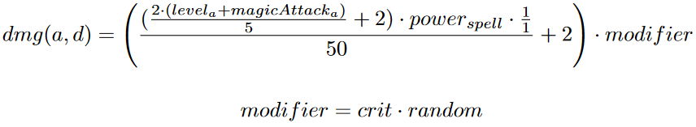

[](https://gitpod-redirect-0.herokuapp.com/)

# Magie! (chapitre 11.2)

<!-- Avant de commencer. Consulter les instructions à suivre dans [instructions.md](instructions.md) -->

Nous allons étendre le jeu que nous avons fait au chapitre 11.1 en ajoutant une classe de magicien.

## Sort magique
### `magician.Spell`

On veut une classe qui représente un sort magique. Un sort est utilisable comme une arme, et a donc les même propriétés que celle-ci (donc un nom, un niveau de puissance et un niveau minimal) en plus d'un coût d'utilisation en *MP* (points d'énergie magique). 

## Magiciens
### `magician.Magician`

Dans notre jeu, un magicien est un personnage qui peut utiliser de la magie. Un magicien peut faire tout ce qu'un personnage régulier (`Character`) peut faire, comme utiliser une arme physique, en plus d'utiliser un sort de combat qui consomme des points d'énergie magique (des *MP*).

Un magicien a les attributs suivants, en plus de ceux de `Character` :

`Magician.max_mp` : MP maximum. <br>
`Magician.magic_attack` : Le niveau d'attaque magique du personnage. <br>
`Magician.using_magic` : Détermine si le magicien tente d'utiliser sa magie dans un combat. <br>
`Magician.mp` : Les MP restants. <br>
`Magician.spell` : Le sort utilisé par le magicien. <br>

On a aussi la méthode `compute_damage()` qui calcule les dégâts infligés à un autre personnage (en paramètre). Si le personnage utilise son arme physique, la formule est exactement la même que pour les personnages réguliers :


Où *a* est l'attaquant et *d* est le défendeur. <br>
*crit* est 2 environ 1/16 (6.25%) du temps, 1 sinon <br>
*random* est un nombre aléatoire entre 85% et 100%

Si le personnage utilise sa magie, le calcul est différent. La méthode `Magician.will_use_spell()` indique si le magicien utilise sa magie ou pas. On utilise exactement la même formule (donnée par `Character.compute_damage_output()`), mais en lui passant des valeurs différentes :



Où *a* est l'attaquant et *d* est le défendeur. <br>
*crit* est 2 environ 1/8 (12.5%) du temps, 1 sinon <br>
*random* est un nombre aléatoire entre 85% et 100%

On voit que le facteur de niveau est en fait le niveau du personnage + son attaque magique. On remarque aussi que le ratio attaque/défense est remplacé par 1. En effet, on suppose qu'il n'y a pas de défense contre la magie dans notre jeu. On passe donc `level + magic_attack` comme niveau et 1 comme attaque et défense à la formule de base.

## Déroulement d'un combat

### `game.deal_damage()` et `game.run_battle()`

Exemple :
```python
	c1 = Character("Äpik", 500, 150, 70, 70)
	c2 = Magician("Damn! That magic dude", 450, 100, 50, 150, 50, 65)

	c1.weapon = Weapon("BFG", 100, 69)
	c2.spell = Spell("Big Chungus Power", 100, 35, 50)
	c2.weapon = Weapon("Slingshot", 80, 20)
	c2.using_magic = True

	turns = run_battle(c2, c1)
	print(f"The battle ended in {turns} turns.")
```

Sortie :
```
Damn! That magic dude would like to battle.
Äpik accepted!
  Damn! That magic dude used Big Chungus Power
    Critical hit!
    Äpik took 306 dmg
  Äpik used BFG
    Damn! That magic dude took 163 dmg
  Damn! That magic dude used Big Chungus Power
    Äpik took 166 dmg
  Äpik used BFG
    Damn! That magic dude took 181 dmg
  Damn! That magic dude used Slingshot
    Äpik took 29 dmg
  Äpik is sleeping with the fishes.
The battle ended in 5 turns.
```
