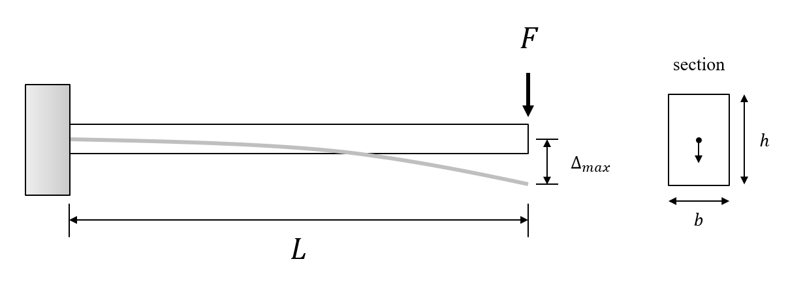

# Projet 1 - Que de contraintes...

<!--- Changer la date de remise en modifiant le URL--->
#### :alarm_clock: [Date de remise le lundi 28 septembre à 23h59](https://www.timeanddate.com/countdown/generic?iso=20200928T2359&p0=165&msg=Remise&font=cursive&csz=1#)

## Objectif
Concevoir et implémenter un programme permettant de calculer la déformation d'une poutre encastrée sous l'effet d'un poids à son extrémité.
Pour ce faire, vous devez compléter les deux programmes `poutre_rect.py` et `poutre_section.py`.

## Partie 1 : Poutre rectangulaire
À faire : compléter le fichier `poutre_rect.py`

Considérant que la section de la poutre est rectangulaire tel que présenté à la figure ci-dessous, et considérant les données fournies dans le fichier, vous devez écrire un programme permettant de calculer la déformation maximale de la poutre (`delta_max`). Vous devrez au préalable calculer le moment quadratique de la section (Appelé *inertie* dans le code source).



Exemple d'affichage :
```
La déformation maximale de la poutre est 42.24 mm
```

## Partie 2 : Optimisation de contraintes
À faire : compléter le fichier `poutre_section.py`

Concevoir un programme qui permet, considérant les données d'entrée fournies dans le fichier, d'afficher le type de section minimisant la déformation maximale de la poutre.

Votre programme doit afficher la réponse suivant une nomenclature précise :
```
Le type de section minimisant la déformation maximale est <section>, avec une déformation de <delta_max> mm
```
où :
- <section> est le type de section, pouvant prendre les valeurs : `rectangulaire`, `carrée`, `ronde`et `creuse`.
- <delta_max> est la déformation maximale correspondant à ce type de section, arrondi avec deux décimales.

Exemple d'affichage :

```
Le type de section minimisant la déformation maximale est ronde, avec une déformation de 20.07 mm
```

Pour résoudre cet exercice, vous devez utiliser des structures de contrôles.

## Ressources
### Calcul de la déformation maximale
Afin de résoudre ce problème, nous pouvons utiliser des formules connues en résistance des matériaux permettant de calculer la flèche maximale, ainsi que la déformée de la poutre.

La formule de la déformation maximale pour une poutre encastrée est:


où:

- F est la force appliquée 
- E est le module de Young
- I est le moment quadratique de la section (appelé *inertie* dans les sources)
- L est la longueur de la poutre

### Calcul du moment quadratique de la section

Le tableau suivant présente les formules permettant de calculer le moment quadratique de la poutre en fonction de son type de section (rectangulaire, carré, rond, creux) et de ses paramètres.


