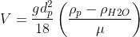
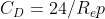
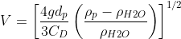
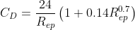

# Projet 3 - Vitesse de chute

<!--- Changer la date de remise en modifiant le URL--->
#### :alarm_clock: [Date de remise le dimanche 15 novembre à 23h59](https://www.timeanddate.com/countdown/generic?iso=20201115T2359&p0=165&msg=Remise&font=cursive&csz=1#)

## Objectif
Ce problème consiste à calculer la vitesse d’une particule dans l’eau, en utilisant un processus itératif et en tenant compte du type d’écoulement. Certaines caractéristiques du problème sont connues et spécifiées. Toutes les mesures doivent être effectuées dans le système de mesure international.

Dans ce projet, vous devez compléter deux aspects de programmation : 
- l'implémentation de fonctions pour résoudre le problème
- l'implémentation de tests unitaires pour vérifier que votre programme fonctionne bien.

Afin de calculer la vitesse de la particule, vous devez implémenter les fonctions suivantes dans le fichier [exercice.py](exercice.py) : 
1. `proprietes_eau(temperature)`, 
2. `regime_stockes(diametre_particule, rho_particule, rho_eau, mu_eau)`, 
3. `regime_intermediaire(Rep, diametre_particule, rho_particule, rho_eau, mu_eau)` et 
4. `calcule_vitesse(rho_particule, diametre_particule, temperature_eau)`.

### 1. proprietes_eau(temperature)

Cette fonction doit calculer les propriétés de l'eau ( et )  pour une température donnée, en s'aidant de la base de données fournie dans le fichier [data/data.csv](data/data.csv).

Cependant, cette base de données ne fournit que des valeurs de  et  pour des températures égales à un multiplication de 5. Vous devez donc implémenter un algorithme qui calcule les valeurs de  et  pour des valeurs intermédiaires, en interpolant linéairement les valeurs présentes dans la base de données.

Par exemple, une température de 14.3˚C doit approximer les propriétés de l'eau à  et .

On assume que la température passée en paramètre est toujours entre 0 et 40, exclusivement.

### 2. regime_stockes(diametre_particule, rho_particule, rho_eau, mu_eau)

Cette fonction retourne les valeurs de ,  et  dans le cas d'un régime de Stockes (), en utilisant les formules ci-dessous :





### 3. regime_intermediaire(Rep, diametre_particule, rho_particule, rho_eau, mu_eau)

Cette fonction retourne les valeurs de ,  et  dans le cas d'un régime intermédiaire (), en utilisant les formules ci-dessous :






### 4. calcule_vitesse(rho_particule, diametre_particule, temperature_eau)

Cette fonction calcule et retourne la vitesse d'une particule dans l'eau en fonction de la température de l'eau ainsi que des propriétés de la particule (masse volumique et diamètre).

- Le diamètre de la particule est 
- La masse volumique de la particule est 
- Le nombre de Reynolds de la particule est donné par 

#### **Algorithme itératif pour calculer la vitesse de chute de la particule :**
1. Initialement, on fait l’hypothèse que l’on se trouve dans un régime de Stockes
    - On calcule ,  et 
    - Si , le problème est résolu et la vitesse de la particule est égal à 
    - Sinon, on passe à l’étape suivante.
2. On passe en régime intermédiaire
	- On utilise  calculé précédemment pour calculer ,  et le nouveau 
	- On compare  avec  calculé précédemment. Si la différence est plus grande que 0.001, on recommence l’étape 2, en s’assurant de rester en régime intermédiaire.
	- Si la différence est plus petite que 0.001, le problème est résolu.

À chaque itération, il est important d’afficher les résultats de ,  et .

## Exemple :
```
>>>calcule_vitesse(rho_particule=2000, diametre_particule=1e-3, temperature_eau=14.3)

Régime de Stockes
V=0.469, Cd=0.060, Rep=402.245
Régime intermédiaire
V=0.146, Cd=0.616, Rep=125.232
V=0.116, Cd=0.981, Rep=99.224
V=0.110, Cd=1.088, Rep=94.204
V=0.108, Cd=1.114, Rep=93.091
V=0.108, Cd=1.120, Rep=92.836
```

# Tests unitaires
Afin de vous assurer que votre programme fonctionne bien, vous devez implémenter un test unitaire pour chacune des quatre fonctions implémentées, dans le fichier [test_exercice.py](test_exercice.py).

