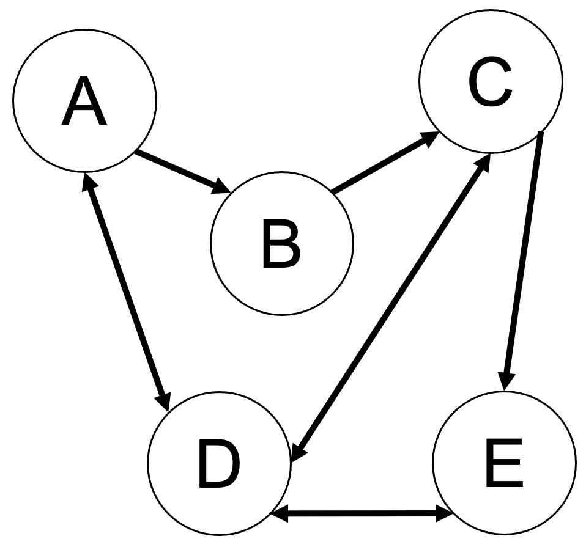

# Projet 4 - Graphes

<!--- Changer la date de remise en modifiant le URL--->
#### :alarm_clock: [Date de remise le dimanche 6 décembre à 23h59](https://www.timeanddate.com/countdown/generic?iso=20201206T2359&p0=165&msg=Remise&font=cursive&csz=1#)

## Objectif
La théorie des graphes est la discipline mathématique et informatique qui étudie les graphes, lesquels sont des modèles abstraits de dessins de réseaux reliant des objets. Ces modèles sont constitués par la notion de noeuds (aussi appelés sommets ou points), et d'arêtes (aussi appelées liens ou lignes) entre ces noeuds ; ces arêtes sont parfois non-symétriques (les graphes sont alors dits orientés) et sont appelés des flèches.

En programmation Python, un graphe orienté peut être représenté par un série de noeuds, par exemple sous la forme d'une liste, qui eux-même contiennent l'information concernant les arêtes les liant. Dans l'exemple ci-dessous, le noeud A est connecté au noeud B et D tandis que le noeud E est uniquement connecté au noeud D. Une arête consiste donc à définir les noeuds avec lequel un noeud est connecté.



Dans ce projet, vous devez implémenter une classe `Graphe` permettant de manipuler cette structure de données, avec les propriétés suivantes :
- Un graphe est représenté par une série de noeuds, qui sont eux-même représentés par la classe `Noeud` (décrite ci-dessous). Les arêtes sont directement définies comme attributs de la classe Noeud, tel que décrit plus loin.
- La classe `Graphe` définit un constructeur initialise le graphe, vide au départ.
- La classe `Graphe` implémente une fonction ```ajoute_noeud(self, noeud: Noeud, aretes: list)``` qui permet d'ajouter un noeud au graphe. Un noeud ne doit pas nécessairement être connecté à d'autres noeuds pour faire partie du graphe. Un noeud doit être unique dans le graphe. Les arêtes données en argument doivent être ajoutées aux voisins du noeud.
- La classe `Graphe` implémente une fonction ```ajoute_arete(self, noeud1: Noeud, noeud2: Noeud)``` qui permet d'ajouter une flèche entre le noeud 1 et le noeud 2. Un noeud peut avoir un nombre illimité de flèches.
- La classe `Graphe` implémente une fonction ```trouve_chemin(self, debut: Noeud, fin: Noeud, chemin: list)``` qui retourne le chemin vers entre deux noeuds sous la forme d'une liste de `Noeud`. Dans l'exemple ci-dessus, le chemin entre les noeuds 'A' et 'E' pourrait être ['A', 'B', 'C', 'D', 'E'] ou encore ['A', 'D', 'E']. Cette fonction doit seulement fournir un des chemins possibles. Indice : résoudre ce problème est relativement simple à l'aide d'un algorithme récursif.

La classe `Noeud` est une classe très simple qui doit implémenter les caractéristiques suivantes :
- un constructeur qui prend en entrée son nom, sous la forme d'une chaîne de caractère, et qui initialise deux attributs : le nom du noeud (`nom`) et une liste (`voisins`), vide au départ, qui contiendra les noeuds auquel il est lié par une arête.
- une fonction `ajoute_voisin(self, noeud: Noeud)` qui permet d'ajouter un noeud à la liste des voisins,
- une fonction de conversion `__str__` permettant d'afficher le nom du noeud et ses voisins lorsqu'on affiche l'objet avec la fonction `print()`, et
- une fonction de conversion `__repr__` retournant le nom du noeud.

Dans ce projet, vous devez compléter le fichier `exercice.py`. Le bloc d'instruction dans la fonction `main` vous montre un cas concret d'utilisation du programme, qui evrait vous fournir un affichage tel que présenté ci-dessous :

```
A est connecté à B, D
D est connecté à A, C, E
E est connecté à D
Le chemin entre B et A est [B, C, D, A]
Le chemin entre E et B est [E, D, A, B]
```
